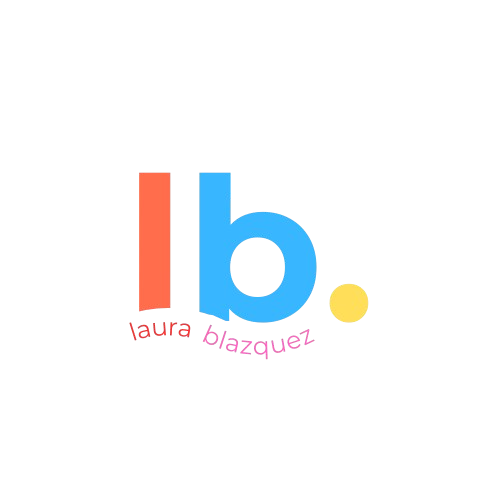

<h1 align="center">
  <br>
  <a href="#">
    
  </a>
  <br>
  Portfolio Personal - Laura Blázquez Castillo
  <br>
</h1>

<h4 align="center">
  Mi portfolio personal como desarrolladora, con proyectos en programación, inteligencia artificial y ciberseguridad.
</h4>

<br>


## 🚀 Cómo usar este proyecto

Para clonar y ejecutar esta aplicación necesitas [Git](https://git-scm.com) y [Node.js](https://nodejs.org/en/download/).  
Desde tu terminal:

```bash
# Clonar este repositorio
$ git clone https://github.com/LauraBlzqz/mi-portfolio

# Entrar en la carpeta del proyecto
$ cd mi-portfolio

# Instalar dependencias
$ npm install

# Ejecutar en local
$ npm start


#🛠️ Tecnologías usadas

#React, Framer Motion, React Icons

#📌 Nota

#Este portfolio está en constante mejora y actualización.Algunas secciones pueden estar vacías temporalmente mientras preparo nuevos proyectos. 🚧